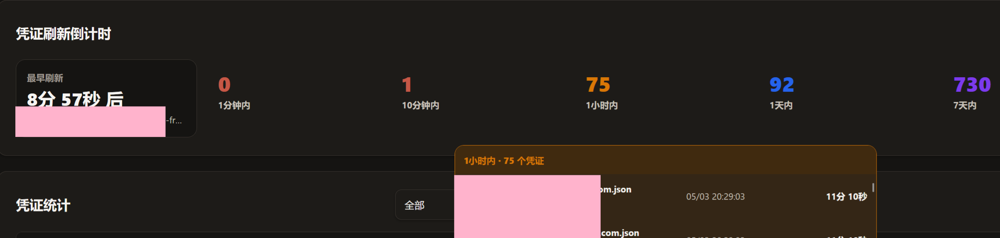
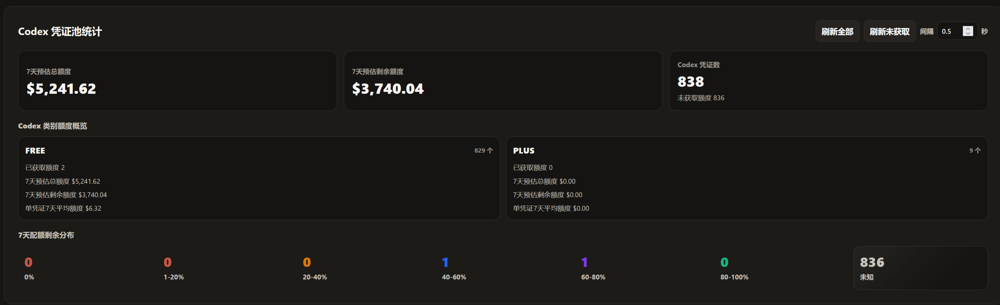

# Cli-Proxy-API-Management-Center

> 本仓库为上游 Web UI 项目的二次开发版本。
>
> 原始/基础功能请参考上游仓库：https://github.com/router-for-me/Cli-Proxy-API-Management-Center

> [!IMPORTANT]
> 兼容说明：官方 CPA 已移除使用统计 API。
>
> 如需使用本 fork 的「监控中心」完整功能，必须搭配本 fork 适配的后端：
> https://github.com/Fwindy/CLIProxyAPI

本 README 只记录 **本 fork 相对上游新增/增强的功能点**。

## 本 fork 新增/增强功能

### 新增监控中心页面

- 类似于使用统计界面，但界面美化&增强。
  - 新增「花费与Token」趋势图。
  - 新增「模型使用分布」统计。

- 增强凭证统计
  - 新增凭证花费统计
  - 对于Codex凭证：可一键刷新配额，并根据配额的截止时间往前倒推统计5h花费/周花费。

- 增强请求事件明细：
  - 支持自动刷新（15s/30s/1m/5m）
  - 新增Tokens per second (TPS) 统计
  - 新增首字延迟统计
  - 点击每行前方的减号图标可以删除记录
  - 新增缓存命中率统计

  - 当请求失败时，可点击“失败”查看失败日志（实际上是该凭证的最新状态日志，非精确的请求日志）。

- 一键导入模型价格
  - 从 https://models.dev/api.json 拉取最新价格并导入，对于多Provider的模型，可以手动指定优先用哪个Provider的价格
  - 仅对 **已有使用记录** 的模型进行匹配与同步
  - 支持CPA模型名称映射，例如把CPA中的coder-model先映射为qwen3.6-plus后再进行价格匹配

### 新增凭证中心页面

- 凭证刷新倒计时
  - 读取自动刷新调度队列，按「1分钟内 / 10分钟内 / 1小时内 / 1天内 / 7天内 / 更长时间」统计待刷新凭证数量。
  - 展示最早刷新倒计时，帮助判断是否适合退出进程。
  - 点击任一时间段可展开该段凭证明细，查看 provider、账号和预计刷新时间。

- Codex 凭证池统计
  - 支持「刷新全部」「刷新未获取」两个批量刷新入口，可设置刷新间隔秒数，并显示批量刷新进度。
  - 展示 7天预估总额度、7天预估剩余额度，以及 Codex 凭证数和未获取额度数量。
  - 按 Codex 类别展示凭证数、已获取额度数、7天预估总额度、7天预估剩余额度、单凭证7天平均额度。
  - 按固定百分比分档展示各凭证的 7 天配额剩余情况，适合大量凭证快速观察分布。

## 使用方法

在CPA的配置面板中，设置面板仓库为本仓库地址后，强制刷新（Ctrl+F5）页面

## 友链

## License

MIT
